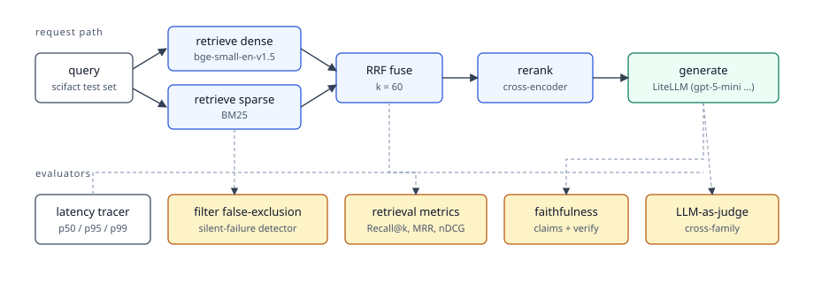

# rag-evals

A runnable companion to *Evaluating RAG: Metrics for Every Stage of a Production RAG System*. Every metric the article discusses, wired up against a real corpus, ready to run on a laptop.

## Quickstart

```bash
cp .env.example .env       # adjust keys; the suite runs offline if you skip them
uv sync --all-extras
make index                 # ingest scifact + build golden sets (~3-5 min on CPU)
make eval                  # full suite -> report.md, exits non-zero on regressions
make benchmark             # chunking × embedding × LLM sweep -> report/benchmark.{md,json}
make nb                    # execute every notebook in-place (mock backend by default)
```

The index lives in embedded Qdrant (a local file at `./qdrant_storage`). No Docker, no daemon. To run against a Qdrant server instead, set `QDRANT_URL=http://localhost:6333` in `.env` and point it at your own deployment.

## Architecture

Three layers, one per failure class the article calls out:

- **Offline.** Corpus, chunking, embedding, and indexing into Qdrant (one collection with named dense + sparse vectors).
- **Online.** Dense + sparse retrieval, RRF fusion, and an optional cross-encoder rerank.
- **Post-generation.** Faithfulness, lost-in-the-middle, LLM-as-judge with bias mitigation, latency telemetry.


See [`docs/architecture.md`](docs/architecture.md) for the full request/response trace.

The request path and the evaluators that hang off it:



## What's evaluated

| Metric                            | Module                                 | Notebook | Docs                                                  |
| --------------------------------- | -------------------------------------- | -------- | ----------------------------------------------------- |
| Recall@k, MRR, nDCG, MAP, etc.    | `evaluation/retrieval.py`              | 01       | [retrieval](docs/metrics/retrieval.md)                |
| Hybrid + RRF                      | `retrieval/hybrid_rrf.py`              | 02       | [retrieval](docs/metrics/retrieval.md)                |
| Reranker uplift                   | `retrieval/reranker.py`                | 03       | [retrieval](docs/metrics/retrieval.md)                |
| **Filter false-exclusion rate**   | `evaluation/filter_exclusion.py`       | 04       | [filter false-exclusion](docs/metrics/filter-false-exclusion.md) |
| Faithfulness (RAGAS-style)        | `evaluation/faithfulness.py`           | 05       | [faithfulness](docs/metrics/faithfulness.md)          |
| Lost-in-the-middle                | `evaluation/lost_in_middle.py`         | 06       | [lost-in-the-middle](docs/metrics/lost-in-the-middle.md) |
| LLM-as-judge w/ bias mitigation   | `evaluation/llm_judge.py`              | 07       | [llm-as-judge](docs/metrics/llm-as-judge.md)          |
| Latency p50/p95/p99               | `evaluation/latency.py`                | 08       | [latency-and-cost](docs/metrics/latency-and-cost.md)  |

Every section of the article that fits on a single corpus has a destination here. The metrics that don't fit — OCR / CER / WER, entity-linking F1, hierarchical ontology metrics, production drift, A/B testing — are explicitly out of scope.

## Notebooks tour

- **00 — Setup and index.** Open the embedded Qdrant store, ingest scifact, sanity-check counts.
- **01 — Retrieval metrics.** Dense baseline; Recall@k / MRR / nDCG sweep.
- **02 — Hybrid + RRF.** Dense vs BM25 vs RRF, per-query deltas.
- **03 — Reranking.** ΔnDCG and ΔPrecision@1 from the cross-encoder.
- **04 — Filter false-exclusion.** *Does my filter silently drop the right document before retrieval ever runs?* The article's signature metric on real metadata.
- **05 — Faithfulness.** Claim extraction + verification on generated answers.
- **06 — Lost-in-the-middle.** Position-stratified placement of the gold chunk.
- **07 — LLM-as-judge.** G-Eval, pairwise, position-bias measurement, cross-family judges.
- **08 — Full eval dashboard.** Every metric on the same eval set.
- **09 — Benchmark report.** Loads `report/benchmark.json` produced by `make benchmark` and renders the chunking × embedding × LLM sweep as tables and bar charts.

Notebooks run offline against `MockBackend` if you don't set any LLM API keys (`make nb` forces this).

## Benchmarking

`make benchmark` runs three sweeps and writes the results to `report/benchmark.md` (human-readable) and `report/benchmark.json` (machine-readable):

- **Chunking sweep.** Embedding fixed (`bge-small-en-v1.5`), chunking varied (`recursive` at 128/256/512 tokens + `structural`). Compares retrieval metrics (Recall@10, MRR, nDCG@10, MAP).
- **Embedding sweep.** Chunking fixed (`recursive 256/32`), embedding varied (`bge-small-en-v1.5`, `all-MiniLM-L6-v2`, `bge-base-en-v1.5`). Same retrieval metrics; lets you see the dim/quality trade-off.
- **LLM sweep.** Retriever fixed (the default scifact index), generator varies across `gpt-5-mini`, `claude-haiku-4-5`, and `gemini-2.5-flash`. Reports avg & p95 latency, faithfulness (heuristic + cross-family LLM judge), and a pairwise A/B head-to-head where the third model is the judge.

Each variant index lives in its own subdirectory under `qdrant_bench/`, so the sweeps don't perturb the default scifact index. Knobs:

```bash
# default: 800 docs, 30 queries per index variant, 15 LLM queries
uv run python -m rag_evals.scripts.benchmark \
    --n-docs 800 --n-queries 30 --n-llm-queries 15
# subset (skip arms that you don't have keys for, or just want to skip):
uv run python -m rag_evals.scripts.benchmark --skip-llm
```

Notebook `09_benchmark.ipynb` reads `report/benchmark.json` and plots the sweeps. Re-run the script to refresh the JSON, then re-execute the notebook.

## Reproducing the article numbers

```bash
# Recall@5 = 0.750, MRR = 0.625, nDCG@5 = 0.627
uv run pytest tests/test_retrieval_metrics.py -v

# Filter false-exclusion = 0.50 (the worked example from Part 5)
uv run pytest tests/test_filter_exclusion.py::test_50_percent_exclusion_rate -v

# RRF ordering d3 / d2 / d1 with k=60
uv run pytest tests/test_rrf.py -v
```

## Configuration

All knobs live in `.env` (read via Pydantic Settings).

- `RAG_EVALS_DEFAULT_MODEL`. Generator + claim extractor (e.g. `gpt-5-mini`).
- `RAG_EVALS_JUDGE_MODEL`. Second model for cross-family judging (e.g. `claude-haiku-4-5`).
- `RAG_EVALS_THIRD_JUDGE`. Third leg for self-preference measurement (e.g. `gemini/gemini-2.5-flash`).
- `RAG_EVALS_BACKEND`. `auto` | `live` | `mock`. `auto` falls back to `mock` when API keys are missing.
- `EMBEDDING_MODEL`, `RERANKER_MODEL`, `NLI_MODEL`. Hugging Face IDs.
- `THRESHOLD_*`. Pass/fail gates used by `make eval` to exit non-zero on regression.

Adding a new LLM is one enum line in `src/rag_evals/generation/models.py`. LiteLLM does the rest.

## Project layout

```
src/rag_evals/
  config.py             settings (Pydantic, .env)
  types.py              Document, Chunk, Query, RetrievalHit, RAGAnswer
  data/                 scifact loader, synthetic metadata, golden sets
  ingest/               chunking + ingest pipeline
  index/                Qdrant store (named dense + sparse vectors)
  retrieval/            dense, sparse, hybrid_rrf, reranker, filters
  generation/           Model enum, LiteLLM-backed LLM, prompts, end-to-end RAG
  evaluation/           retrieval, filter_exclusion, faithfulness,
                        lost_in_middle, llm_judge, latency, runner, report
notebooks/              demo tour, 00-08
tests/                  unit tests, including article-fidelity fixtures
docs/                   architecture + per-metric reference pages
```

## License

MIT. Companion to [the article](https://slavadubrov.github.io/) — see the `Evaluating RAG` post.
