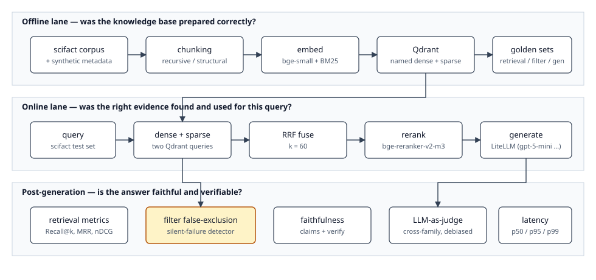
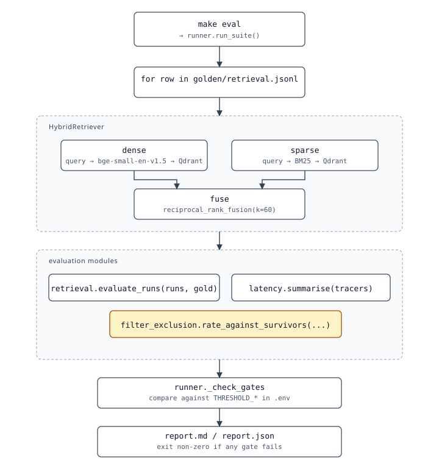

# Architecture

`rag-evals` makes every metric in the *Evaluating RAG* article runnable on a real corpus. Production code lives in `src/rag_evals/`. Notebooks under `notebooks/` import from `src/` and visualise the results — no metric logic is duplicated inside a notebook.

## Three layers

The article splits evaluation into three layers, each one catching a different class of failure:

- **Offline.** *Was the knowledge base prepared correctly?* Parsing, cleaning, chunking, embedding, indexing.
- **Online.** *Was the right evidence found and used for this query?* Query rewriting, retrieval, reranking, context assembly.
- **Post-generation.** *Is the answer faithful and verifiable?* Faithfulness, citation accuracy, drift, telemetry.



Each layer maps onto a directory under `src/rag_evals/`:

| Layer            | Code                                                    | Notebooks |
| ---------------- | ------------------------------------------------------- | --------- |
| Offline          | `data/`, `ingest/`, `index/`                            | 00        |
| Online           | `retrieval/`, `generation/rag.py`                       | 01–04     |
| Post-generation  | `evaluation/faithfulness.py`, `evaluation/llm_judge.py` | 05–07     |
| Cross-cutting    | `evaluation/retrieval.py`, `evaluation/filter_exclusion.py`, `evaluation/latency.py` | 04, 08    |

## Single-query trace

What `make eval` actually does for one query in the golden set:



Equivalent in words:

1. `make eval` calls `runner.run_suite()`.
2. For each row in `golden/retrieval.jsonl`, the `HybridRetriever` runs a dense query (bge-small) and a BM25 query against Qdrant, then fuses them with reciprocal rank fusion (k = 60).
3. The result feeds three evaluators: `retrieval.evaluate_runs`, `latency.summarise`, and `filter_exclusion.rate_against_survivors`.
4. `runner._check_gates` compares each metric against the matching `THRESHOLD_*` in `.env` and writes `report.md` / `report.json`. If any gate fails, the process exits non-zero.

## Qdrant collection

One collection (`scifact` by default) with two named vectors per point:

- `dense`: 384-dim, cosine — `BAAI/bge-small-en-v1.5`.
- `sparse`: BM25 sparse vectors — FastEmbed's `Qdrant/bm25`.

The payload keeps the doc id, chunk id, raw text, and synthesized `tenant`/`locale`/`domain`. That metadata is what powers notebook 04 (filter false-exclusion) without needing a parallel index.

## LLM routing

Everything flows through a single `LLM` class wrapping `litellm.completion`. Model selection lives in the `Model` enum at `src/rag_evals/generation/models.py`:

```python
class Model(StrEnum):
    GPT_5_MINI = "gpt-5-mini"
    CLAUDE_HAIKU_4_5 = "claude-haiku-4-5"
    GEMINI_2_5_FLASH = "gemini/gemini-2.5-flash"
    ...
    MOCK = "mock"
```

The judge notebook picks judges from a *different family* than the generator (`cross_family_judges`), since the article's "never use a model to judge itself" rule is the single biggest source of LLM-judge bias.

When `RAG_EVALS_BACKEND=auto` and the relevant API key is missing, the `LLM` falls back to `MockBackend`, a SHA1-keyed deterministic stub. The whole notebook tour runs offline.

## Why this layout

- **One module per metric family.** `evaluation/retrieval.py`, `evaluation/filter_exclusion.py`, `evaluation/faithfulness.py`, and so on. Each is independently importable from a notebook in two lines, and each has a `tests/` mirror.
- **Notebooks are thin.** They import, run, and visualise. A reader can lift any metric into their own pipeline by importing the same module.
- **`runner.py` is the CI surface.** One command writes `report.md` and exits non-zero on threshold violations. Drop it into a GitHub Action without modification.
